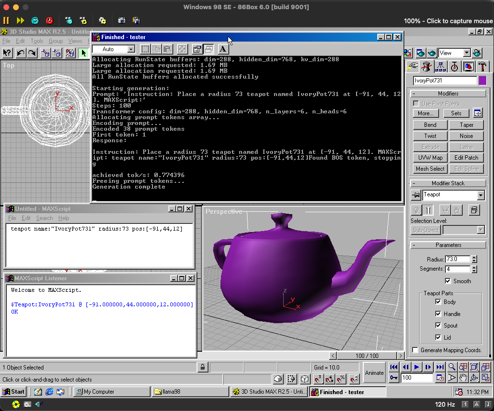

# llama98max

A tiny Llama-2-style model that generates a deliberately narrow subset of legacy MAXScript — and runs on Windows 98, on an emulated 350 MHz Pentium II with 128 MB of RAM.



*TeapotLM-15M running through `llama98.c`, with its generated script executed in 3D Studio MAX R2.5. The screenshot is included for historical and educational commentary.*

## Why I made this

This started as a completely unnecessary, deeply nostalgic geek experiment.

I was 12 in 1998, and Windows 98, Borland Delphi, OpenGL and 3D Studio MAX 2.5 were some of the things that made me obsessed with programming. Almost three decades later, I rebuilt a period-correct Windows 98 workstation in [86Box](https://github.com/86Box/86Box), with MAX 2.5, and wondered whether a genuinely tiny language model could generate MAXScript on a Pentium II.

It can.

The current model, **TeapotLM-15M v0.1**, translates a small controlled-English instruction into one canonical MAXScript command:

```text
Instruction: Place a radius 73 teapot named IvoryPot731 at [-91, 44, 12].
```

```maxscript
teapot name:"IvoryPot731" radius:73 pos:[-91,44,12]
```

The model performs inference entirely on the emulated Pentium II CPU at roughly **0.8 tokens per second**. The generated line can then be executed in the MAXScript Listener to create the object shown above.

## Technical details

| Property | Value |
|---|---:|
| Model | TeapotLM-15M v0.1 |
| Architecture | Llama-2-style causal transformer |
| Parameters | 15,191,712 |
| Layers | 6 |
| Model dimension | 288 |
| Feed-forward dimension | 768 |
| Attention heads | 6 |
| Context length | 256 tokens |
| Vocabulary | 32,000 tokens |
| Weight format | FP32, about 61 MB |
| Base checkpoint | Karpathy's `stories15M.pt` |
| Windows runtime | `llama98.c`, compiled with Borland C++ 5.02 |
| Guest machine | Pentium II 350 MHz, 128 MB RAM, Windows 98 SE |
| Measured speed | approximately 0.77–0.81 tokens/second |
| Model SHA-256 | `3216bbdcde2ac0a302361d62c150d030173c57f88f624f05ee3066c54746d26b` |

The model binary is distributed through [GitHub Releases](https://github.com/ivansivak86/llama98max/releases) rather than stored in normal Git history.

## Dataset and evaluation

The v1 curriculum contains:

```text
5,120 semantic tasks
20,480 instruction / MAXScript records
4 deterministic instruction forms per task
```

Split:

```text
4,096 training tasks
  512 validation tasks
  512 test tasks
```

The scripts are generated by this project's deterministic renderer from independently created semantic specifications. No Autodesk documentation, sample scripts, source code, scenes or other proprietary content was used to create the training answers.

The held-out benchmark was designed to test whether the model copies literals from the instruction rather than selecting values from a memorized closed set:

| Test group | Exact match |
|---|---:|
| Familiar literals, unseen combination | 128 / 128 |
| Unseen generated identifier | 128 / 128 |
| Unseen numeric values | 128 / 128 |
| Unseen identifier and unseen numbers | 128 / 128 |
| **Total** | **512 / 512** |

The reported test score uses one deterministic prompt variant per held-out semantic task.

This is intentionally a **very narrow research model**, not a general MAXScript assistant. Independently worded adversarial prompts can still cause substitutions. In one manual test, for example, a request for `IonPot731` produced `IvoryPot731`. I am keeping that limitation visible because it is part of the experiment and gives the next version a clear target.

## Qwen and the host machine

The first v0 data-generation experiment used my locally running Ollama build of **Qwen3.6 35B/A3B**:

```text
Ollama tag:  qwen3.6:latest
Format:      Q4_K_M
Model ID:    07d35212591f
Local size:  about 23 GB
```

Qwen generated natural-language paraphrases from independently created task specifications; the canonical MAXScript answers still came from the deterministic renderer.

For v1, I deliberately switched to deterministic instruction templates. That isolated the literal-copying problem and made the evaluation easier to interpret. A future version will probably bring Qwen back when the model expands beyond this one-command teapot domain.

All generation and training ran locally on my slightly absurd development machine:

```text
MacBook Pro with Apple M5 Max
40-core GPU
128 GB unified memory
8 TB SSD
```

The host is comically overpowered. The deployment target very much is not.

## Reproducing v1

Clone the repository and its pinned `llama2.c` submodule:

```bash
git clone --recurse-submodules https://github.com/ivansivak86/llama98max.git
cd llama98max

python3 -m venv .venv
source .venv/bin/activate
python -m pip install -r requirements.txt
```

Download the original 15M TinyStories checkpoint:

```bash
mkdir -p models

curl -L --fail --show-error \
  -o models/stories15M.pt \
  https://huggingface.co/karpathy/tinyllamas/resolve/main/stories15M.pt
```

Expected checkpoint SHA-256:

```text
3da00c0fef684f3f83b457736837c46ab55e92a26662b61d6104de2d271c708d
```

Generate, validate and tokenize the dataset:

```bash
python generate_teapot_v1.py

python validate_teapot_v1.py \
  --tasks data/tasks.teapot-v1.jsonl \
  --records data/paraphrases.teapot-v1.jsonl

python prepare_sft_v1.py \
  data/paraphrases.teapot-v1.jsonl \
  data/sft.teapot-v1.tokens.jsonl
```

Fine-tune from the original `stories15M.pt` checkpoint:

```bash
python train_sft_v1.py \
  --data data/sft.teapot-v1.tokens.jsonl \
  --checkpoint models/stories15M.pt \
  --device mps \
  --epochs 12 \
  --batch-size 64 \
  --eval-every 1 \
  --dropout 0.05
```

The legacy llama2.c-compatible FP32 model is written to:

```text
artifacts/teapot15m-v1/teapot15m-v1.bin
```

On a non-Apple system, use `--device cuda` or `--device cpu` as appropriate.

## Running it on Windows 98

For the retro deployment I used:

- [llama98.c](https://github.com/exo-explore/llama98.c)
- Borland C++ 5.02
- Windows 98 SE running in 86Box
- the standard 32K tokenizer used by `llama2.c`

After copying the model into the guest as `V1.BIN`, this script prints four short Windows 98 test commands:

```bash
python make_win98_tests_v1.py
```

A typical command is:

```bat
R V1.BIN -z T.BIN -t 0 -n 80 -i "Instruction: Place a radius 73 teapot named IvoryPot731 at [-91, 44, 12]. MAXScript:"
```

The generated line can then be executed inside the MAXScript Listener.

The standard tokenizer can be exported from the pinned upstream submodule with:

```bash
(cd vendor/llama2c && python tokenizer.py)
```

It is intentionally not redistributed as part of this project's MIT-licensed artifacts and remains subject to its upstream terms.

## Repository contents

Downloaded checkpoints, tokenized data, training artifacts, virtual environments and exported model binaries are generated locally and excluded from normal Git history.

## Thanks

This would not exist without:

- [Andrej Karpathy's llama2.c](https://github.com/karpathy/llama2.c), including the tiny `stories15M` checkpoint and its wonderfully hackable training/export stack
- [EXO's llama98.c](https://github.com/exo-explore/llama98.c), which made real Llama-style inference on Windows 98 and old Pentium hardware possible
- [86Box](https://github.com/86Box/86Box), which made the period-correct workstation possible
- the Qwen and Ollama teams, whose local model helped bootstrap the first corpus experiment

A lot of the implementation, debugging and late-night excitement also happened in a long pair-programming conversation with ChatGPT.

## License and trademarks

The original code and independently generated project data in this repository are released under the MIT License unless a file says otherwise. The pinned submodule, downloaded base checkpoint and tokenizer retain their respective upstream terms.

The screenshot is not licensed under the repository's MIT License.

This is an independent retro-computing research project. It is not affiliated with, sponsored by, authorized by or endorsed by any third party company.
